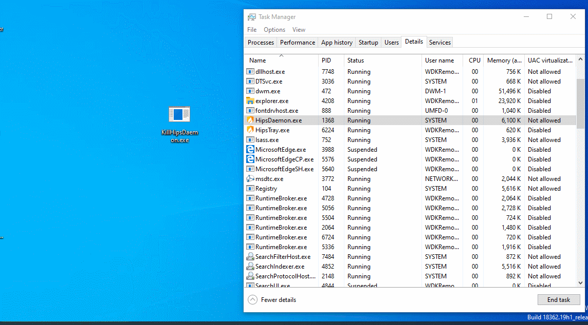

# 结束HipsDaemon.exe

## 描述

非常出乎我的意料。火绒保护它的进程不被结束，却忘记了保护它的线程... 于是思路很简单: 使用`RtlAdjustPrivilege`函数提权，然后找到它的进程，列出对应的所有线程，然后全部杀光。搞定！原理跟[KillTray1](/KillTray1)里介绍的一样，只不过换了个进程名而已。

源码: [KillHipsDaemon.c](KillHipsDaemon.c)

# Termiante HipsDaemon.exe

## Description

Very unexpected. Huorong protects its process from being terminated, but forgets to protect its threads... So the idea is very simple: use `RtlAdjustPrivilege` function to raise privilege, then find its process, list all corresponding threads, and then kill them all. Done! The idea is the same as introduced in [KillTray1](/KillTray1), except the process name is different.

Source code: [KillHipsDaemon.c](KillHipsDaemon.c)

# 效果 / Effect
