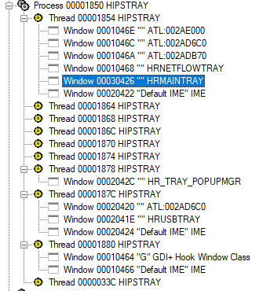
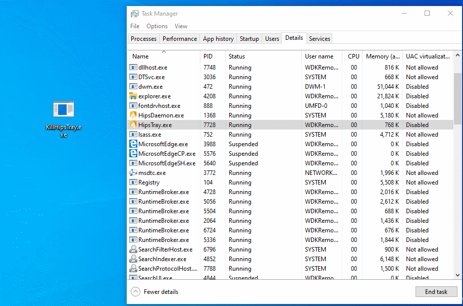

# 结束HipsTray.exe

## 描述

这是一个比较常见的攻击方式 - 对火绒安全的窗口发送大量的窗口消息，导致其崩溃。由于HipsDaemon.exe没有创建窗口，故不能以此方式崩掉它。

源码: [KillHipsTray.c](/KillHipsTray.c)

# Termiante HipsTray.exe

## Description

This is a relatively common attack method - sending a lot of window messages to Huorong Internet Security window to crash it. This method cannot crash HipsDaemon.exe because it does not create a window.

Source code: [KillHipsTray.c](/KillHipsTray.c)

# 分析 / Analysis

 HipsTray.exe创建的窗口 / Windows created by HipsTray.exe  

我的程序就是向这个窗口发送大量的消息导致其进程崩溃。

My program sends a lot of message to this window to crash the process.

# 效果 / Effect
