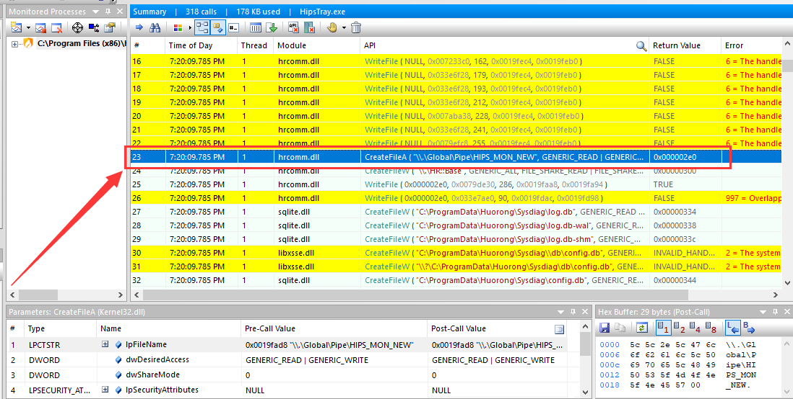
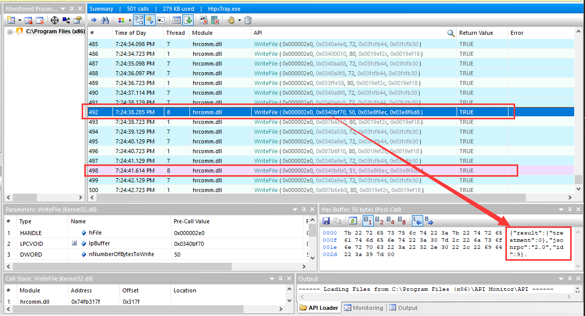
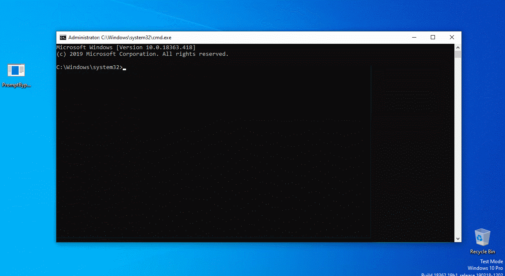

# 绕过防御提示

## 描述

这个方法主要是利用了火绒的用户模式(user-mode)进程和其保护驱动通讯的漏洞。当保护驱动拦截到敏感操作的时候会通知用户模式进程弹出提示框，而当用户选择提示框上面的“允许”或者“组织”的时候用户模式进程会使用`WriteFile`函数通知保护驱动用户选择的操作。第三方程序能够成功打开它们用来通讯的设备，并能够伪造用户的回应发给保护驱动。

源码: [PromptBypass.c](/PromptBypass.c)

# Bypass Protection Prompt

## Description

This method uses a flaw in the communication between Huorong user-mode process and its protection driver. When the protection driver intercepts sensitive operations, it will ask the user-mode process to popup the prompt. When the user chooses "Allow" and "Decline" on the prompt window, the user-mode process will use `WriteFile` to tell the user's choice to the protection driver. A third-party program can open the device they used to communicate, fake the user's response, and send it to the protection driver.

Source code: [PromptBypass.c](/PromptBypass.c)

# 分析 / Analysis

 HipsTray.exe 启动的时候打开的设备 / The device opened when HipsTray.exe starts up  

 用户点击了拦截提示的“允许”后HipsTray.exe给保护驱动的回应 / The response sent by HipsTray.exe to the protection driver when the user clicked "Allow" in the prompt  

从上面的截图可以看出火绒的用户模式进程与内核模式驱动是以json格式通讯的。特别的，当用户选择防护操作后用户模式进程会给保护驱动发回应内容。其中，`treatment`部分是用户选择的操作，0是允许，3是拒绝。`id`可能是被拦截操作的id，每弹框一次它就会加一。

既然我知道了设备名，那么我就可以使用`CreateFile`获取一个写入设备的句柄，然后当检测到有拦截操作的时候使用`WriteFile`往设备写入允许操作的信息，这样便能直接允许操作。由于我们不知道被拦截操作的id是多少，我们可以用一个for循环把某个范围内的id都允许一次。

From the above capture, we can see that the user-mode process communicates with the kernel-mode driver in json format. Particularly, the user-mode process responds to the protection driver when the user chooses the protection operation. The `treatment` section is the operation selected by the user. 0 means allow, 3 means decline. The `id` may be the id of the intercepted operation, and it is added by 1 every time prompt pops up.

Now I know the device name, I can use `CreateFile` to get a handle to write the device. Once I detect an operation is intercepted, I can use `WriteFIle` to write an "Allow" response to the device to allow the operation directly. Since we do not know the id of the intercepted operation, we can use a for loop to allow all id within a certain range.

# 效果 / Effect
